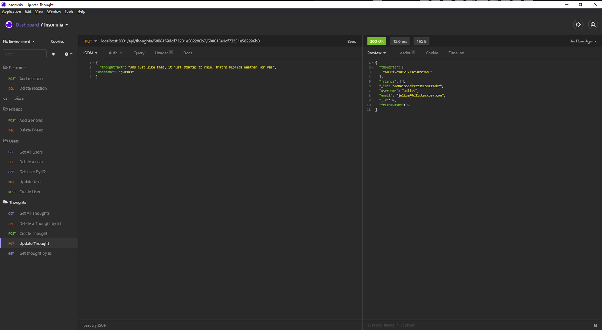

# theSocialNetwork

# Description
The Social Network is and API for testing routes for a social newtwork application. Created with node.js, express.js, mongoDb and Mongoose ODM. Users, Friends, Thoughts and Reactions, can created, deleted, updated using the CRUD standard methods. A video Demo is located [here](https://drive.google.com/file/d/13ON61QPztYEErD1P-m9XuCJnTXb5FykM/view)

# Table of Contents
- [Installation](#installation)
- [Usage](#usage)
- [License](#license)
- [Contributing](#contributing)
- [Questions](#questions)

# Installation
This project requies express.js and Mongoose which both can be install using npm.
To install run `npm install` from the root directory of the project, in the command line. You also must have MongoDB installed on your computer to run the application.

# Usage
To start Run `npm start` in the root directory of the project in the command line to start the server. The CRUD routes can be tested via Insomnia Core.

# License
This project is covered by the [MIT](https://spdx.org/licenses/MIT.html) license.

# Contributing
Julius Maxwell

# Questions
Feel free to reach out if you have any questions

Contact via GitHub: [jmax407](https://github.com/jmax407)  
Send an email: [jmax407@gmail.com](mailto:jmax407@gmail.com)